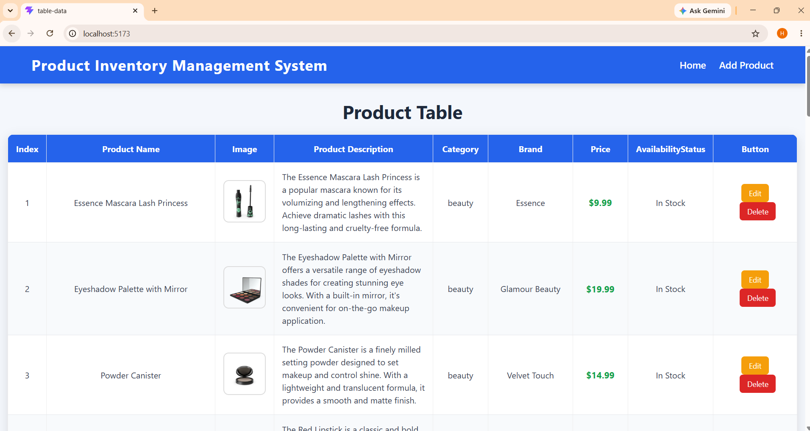

# Product Inventory Management System 📦

## 🔹 Project Description

Product Inventory Management System ek beginner-friendly **React CRUD (Create, Read, Update, Delete)** application hai jo **React.js** aur **DummyJSON API** ka use karke banaya gaya hai.

Is project me user products ko **View, Add, Edit aur Delete** kar sakta hai. Product data API se fetch hota hai aur React state ki help se table automatically update hoti hai. Project me React Router ka use karke different pages ke beech navigation bhi implement ki gayi hai.

---

## 🔹 What is Included in This Project

* 📋 Display Product List
* ➕ Add New Product
* ✏️ Edit Existing Product
* 🗑️ Delete Product with Confirmation
* 🔄 Dynamic UI Updates
* 🧭 React Router Navigation
* 📱 Responsive Design
* 🌐 API Integration using DummyJSON

---

## 🔹 How This Project is Made

* **React Functional Components** ka use karke application develop ki gayi hai.
* **useState()** se product list aur form data manage kiya gaya hai.
* **useEffect()** ka use karke API se product data fetch kiya gaya hai.
* **Fetch API** ki help se DummyJSON API se products retrieve kiye gaye hain.
* **React Router DOM** ka use karke Home, Add, Edit aur Delete pages ke beech navigation implement ki gayi hai.
* **Conditional Rendering** aur **Array map()** ka use karke dynamic product table display ki gayi hai.
* **CSS3** ki help se responsive aur modern user interface design kiya gaya hai.

---

## 🔹 Technologies Used

* React.js
* JavaScript (ES6)
* HTML5
* CSS3
* React Router DOM
* DummyJSON API

---

## 🔹 Features

* View All Products
* Add New Product
* Edit Product Details
* Delete Product with Confirmation
* Responsive Product Table
* Dynamic State Management
* Navigation Between Pages
* Modern User Interface

---

## 🔹 Live / Deploy Link

👉 **Live Project:**


---

## 🔹 Project Explanation Video

👉 **Explanation Video:**


---

## 🔹 Screenshots
👉 **Slider Screen Recording:**
https://drive.google.com/file/d/1m--nabx2ZZEcrsqmZ-JVG8aVrYB3_Vwq/view?usp=drive_link

👉 **Application Screenshot**



---

## 🔹 Project Folder Structure

```text
src/
│── components/
│   ├── Navbar.jsx
│   ├── Footer.jsx
│
│── pages/
│   ├── TableData.jsx
│   ├── AddData.jsx
│   ├── EditData.jsx
│   └── DeleteData.jsx
│
│── App.jsx
│── App.css
│── main.jsx
```

---

## 🔹 Important Note

This project uses the **DummyJSON Mock API**.

* Products are fetched from the API.
* Added, edited and deleted products are updated only in the React application's state.
* Refreshing the page reloads the original product data from DummyJSON because it is a mock API and does not permanently save changes.

---

### ⭐ Thank You
